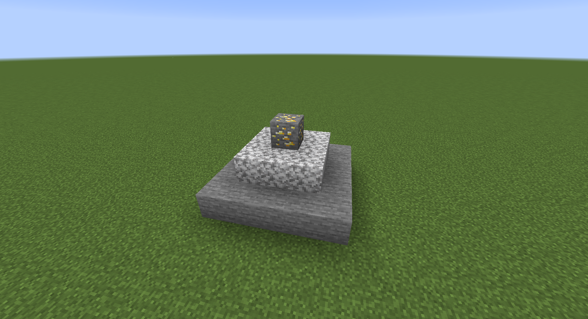
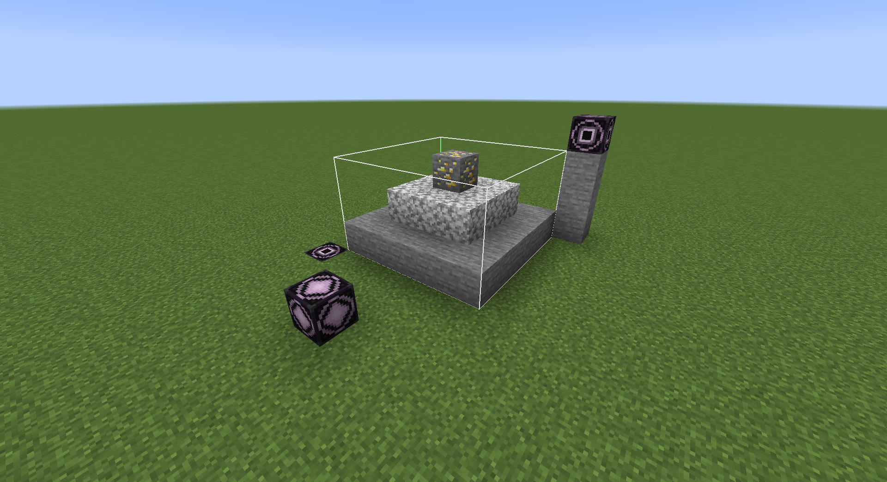
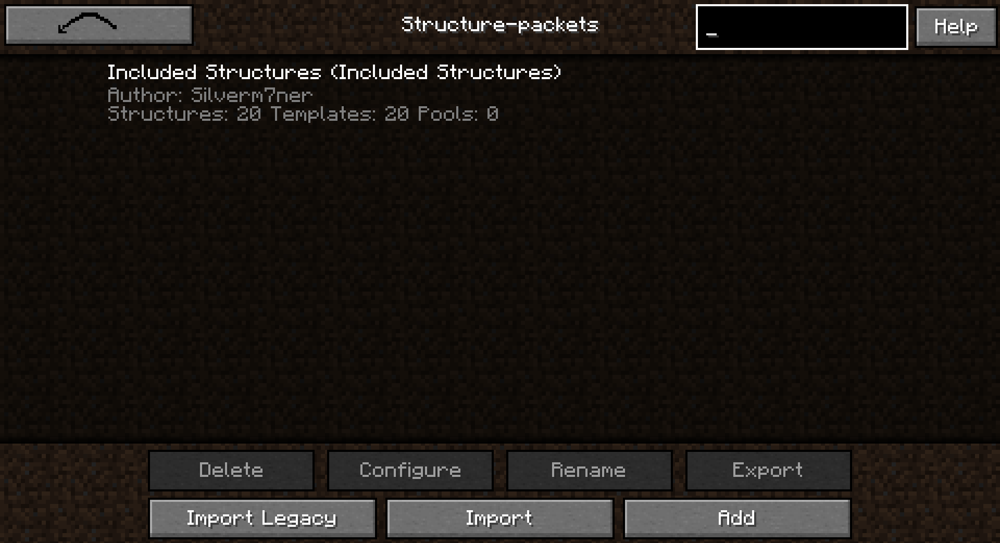
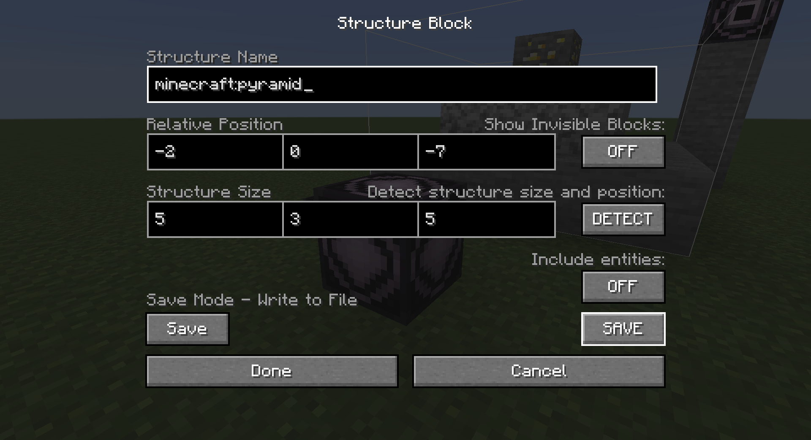
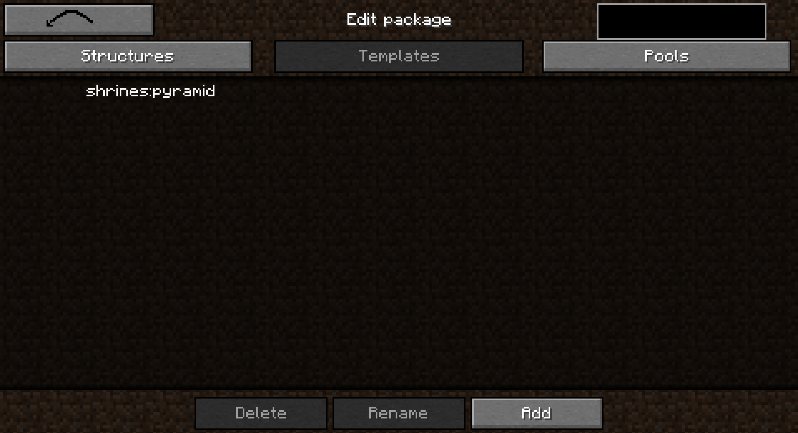
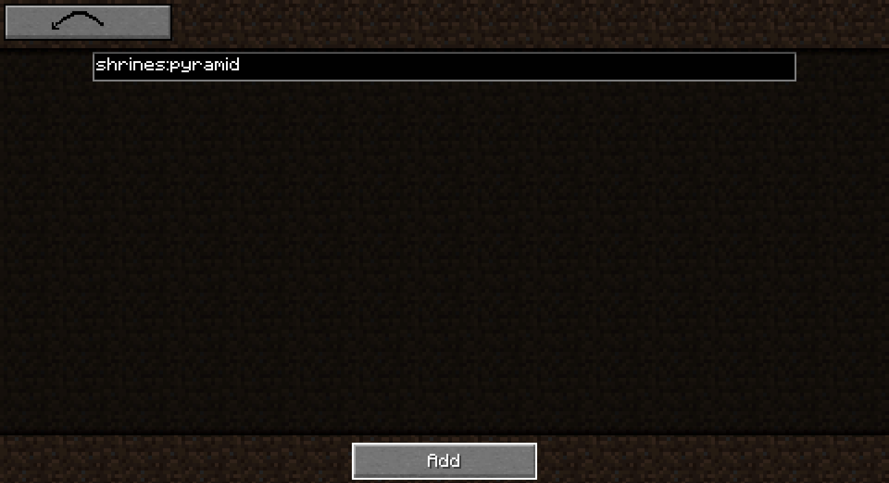
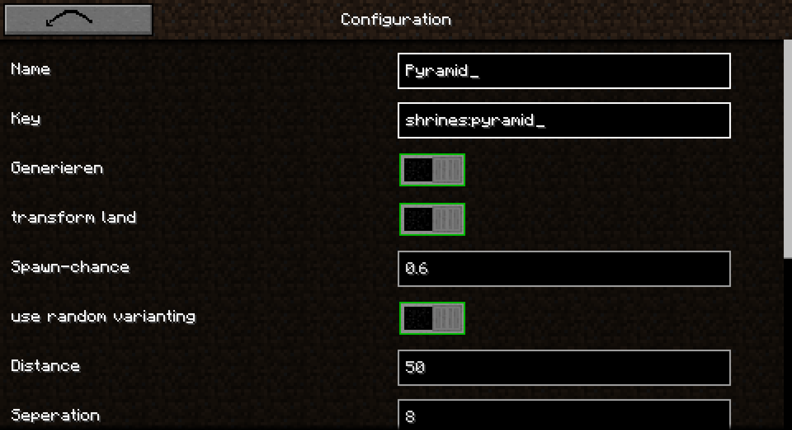

# Shrines Structures

## Eigene Bauwerke

Alle Bauwerke werden in Paketen gebündelt. Diese Pakete erlauben es dir von dir erstelle Bauwerksammlungen mit anderen
zu Teilen, ohne Fehler beim Übertragen zu riskieren. Aus diesem Grund steht eine Import/Export Funktion für die Pakete
bereit.

Die Bauwerk-Pakete enthalten allerdings nicht nur Bauwerk-Konfigurationen, sondern auch Vorlagen und Vorlagen-Pools.
Diese Vorlagen und Vorlagen-Pools werden von den Bauwerken benötigt, um Informationen über die Anordnung der Blöcke zu
erhalten. Eine Vorlage speichert die Anordnung der Blöcke. Der Vorlagen Pool enthält Vorlagen. Das Bauwerk speichert
einen Vorlagen-Pool, aus dem es eine zufällige Vorlage auswählt. Aus dieser Vorlage wird dann die Anordnung der Blöcke
gelesen und diese Blöcke in die Welt geladen.

### Mein erstes eigenes Bauwerk

Ein eigenes Bauwerk lässt sich ganz Einfach in 7 Schritten erstellen und einfügen. Ich werde das Vorlegen anhand einer
Pyramide erklären

1. Wir beginnen damit eine Vorlage zu erstellen

   Um unsere Vorlage zu erstellen, müssen wir zuerst unser Bauwerk, in diesem Fall die Pyramide bauen

   

   Wir müssen nun die Pyramide in eine Datei speichern. Um das zu tun, benötigen wir
   den [Struktur-Block](https://minecraft.fandom.com/wiki/Structure_Block).

   

   Jetzt müssen wir nur noch auf Speichern drücken

   

2. Jetzt können wir die Grafische Oberfläche (GUI) öffnen

   Wir erreichen die GUI zum Bearbeiten der Pakete durch die GUI der Bauwerk-Geschichten. Standardmäßig lässt sich die
   mit der Taste 'k' öffnen. In dieser GUI sehen wir einen Pfeil nach unten in der oberen Rechten ecke. Mit diesem Pfeil
   expandiert die Kopfzeile und der Button zum Öffnen des Administrator-Modus erscheint. Mit diesem erreichen wir die
   Richtige GUI
   

3. Nun müssen wir unser Bauwerk-Paket erstellen

   Wir müssen lediglich auf 'Zufügen' drücken und den Namen für unser Bauwerk-Paket eingeben. Ich wähle hier 'Pyramiden'
   da ich nur Pyramiden in meinem Paket habe

   

4. Jetzt fügen wir unsere in Schritt 1) erstellte Vorlage ein

   Zuerst müssen wir unser Bauwerk-Paket auswählen und auf 'Konfigurieren' drücken. Danach wechseln wir in den Reiter
   'Vorlagen'. Hier drücken wir auf 'Zufügen' und wählen jetzt unsere Datei aus. Wir finden unsere Datei unter '~
   /saves/<\Name der Welt\>/generated/minecraft' wobei <\Name der Welt\> mit dem tatsächlichen Namen der Welt ersetzt
   werden muss. Im darauf folgenden Menü lässt sich der Name der Vorlage ändern. Wir können einfach auf Speichern
   drücken

   

5. Als Nächstes erstellen wir den Vorlagen Pool

   Wir wechseln in den Reiter 'Pools' und drücken dort auf 'Zufügen'. Bei diesem Eingabefeld muss beachtet werden, dass
   nur Kleinbuchstaben, Unterstriche, Schrägstriche und Zahlen erlaubt sind und andernfalls der Button zum Bestätigen
   inaktiv bleibt

   

   Jetzt müssen wir die Vorlage aus Schritt 4) dem Vorlagen-Pool zuweisen. Dazu müssen wir den Pool auswählen und auf
   'Konfigurieren' drücken. Hier wählen wir auch 'Zufügen' und anschließend unsere Vorlage aus Schritt 4)
   
   

   Wir sind nun Fertig mit dem Vorlagen-Pool und können 'Zurück' drücken

6. Es bleibt nur noch das Bauwerk selbst

   Um das Bauwerk selbst zuzufügen, wechseln wir zurück in den 'Bauwerke' Reiter und drücken auf 'Zufügen'. Wir könnten
   alle Optionen ändern, allerdings werden wir uns hier nur mit den wichtigsten 4 beschäftigen:
    1. Name: Hier kann irgendein Name eingetragen werden. Dieser hat keinen Einfluss auf das Bauwerk
    2. Schlüssel: Muss auf jeden Fall geändert werden. Am besten wird hinter den bereits vorhandenen Text ein
       einmaliger (d.h. einen noch nicht verwendeten) text in Kleinbuchstaben eingeben. Der hier eingegeben Schlüssel
       wird benötigt, um das Bauwerk via Befehl zu finden
    
    3. Seed-Veränderer: Sollte auf jeden Fall geändert werden. Siehe Tooltip
    
    4. Start Pool: Hier wählen wir unseren Vorlagen Pool aus Schritt 5)
    

   Alle Einstellungen werden sofort gespeichert und wir können einfach auf 'Zurück' drücken

7. Starte Minecraft einmal vollständig neu und du kannst dein Bauwerk ab sofort finden!

   Du erkennst ein nicht aktives Bauwerk daran, dass es Kursiv geschrieben ist. Bei einem Rot markierten Bauwerk ist ein
   fehl er aufgetreten und es konnte nicht richtig geladen werden

   
### Mehr als eine Vorlage pro Pool

Es ist nicht schwer mehr als eine Vorlage pro Pool zu haben. Wir müssen denselben Schritten folgen wie oben, mit
folgenden Änderungen:

4. Wir wieder holen diesen Schritt für jede Vorlage die wir brachen
5. Wir wählen alle Vorlagen, aus die wir in diesem Pool haben wollen bevor wir auf bestätigen drücken

### Alte Bauwerke Importieren

Für viele Nutzer wurde eine sehr nervige Änderung vollzogen, die es unmöglich machte Bauwerke die mit einer Version
dieser Modifikation vor der Version 2.0.0 erstellt wurde weiter zu nutzen. Aus diesem Grund gibt es die Funktion 'Alte
Importieren'. Bei dieser Funktion wählen wir das Verzeichnis, in dem die Bauwerke gespeichert wurden ausgewählt (Meistens
ist es das Verzeichnis 'shrines-saves' im Minecraft Verzeichnis) und diese Bauwerke werden in ein aktuelles
Bauwerk-Paket konvertiert